### Projektstruktur
Hier in der Projektstruktur sehen wir alle Files, welche wir für das Projekt benötigen.
Im nächsten Schritt werden alle notwendigen Tools für die Nutzung installiert.
```
Modul346-Cloudloesungen-konzipieren-und-realisieren/
├── images               # Dieser Ordner beinhaltet Bilder für die Dokumentation und kann ignoriert werden 
├── csvtojson.sh         # Skript
├── lambda_function.py   # Die eigentliche Lambda Funktion
├── requirements.txt     # Python-Abhängigkeiten
├── test1.csv            # CSV-Datei, welche konvertiert wird
└── README.md            # Dokumentation
```

---

### Schritte zur Installation der benötigten Tools (Linux)

Es ist notwendig die folgenden Commands in der Konsole auszuführen.

---

#### 1. **Repository klonen**
Der erste Schritt besteht darin, das Repository zu klonen.
```bash
git clone https://github.com/Logoko709/Modul346-Cloudloesungen-konzipieren-und-realisieren.git
```
```bash
cd Modul346-Cloudloesungen-konzipieren-und-realisieren
```
---

#### 2. **AWS CLI installieren und konfigurieren**
- **Installation auf Ubuntu/Debian:**
```bash
sudo apt update
```
```bash
sudo apt install awscli -y
```
Nach dem AWS CLI installiert ist muss es noch konfiguriert werden.
Dies kann man mit folgendem Befehl machen:
```
aws configure
```
Als erstes wird man nach der AWS Access Key ID gefragt, dies kann man leer lassen,
da diese jedes mal beim Starten des Labs überschrieben wird.

Auch der AWS Secret Access Key kann leer gelassen werden, da dieser ebenfalls überschrieben wird.

Bei "Default region name" nehemen wir "us-east-1".

Bei "Default output format" nehmen wir "json".
  
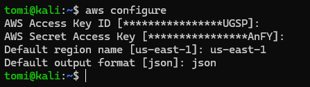


Danach müssen wir die AWS Access Key ID und den AWS Secret Access Key in unsere Credentials einfügen.

Unsere Credentials sind für uns im AWS Lab ersichtlich:

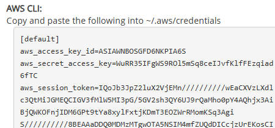  

Diese kopieren wir und raus und bearbeiten dann unser "credentials" File, welches sich im versteckten Ordner ".aws" befindet.

Mit einem Texteditor wie Nano oder einem ähnlichen Editor kopieren wir unsere Credentials rein.

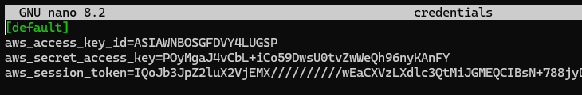


Nun haben wir AWS CLI installiert und konfiguriert.

  
- **Verifizierung:**
    
Mit folgendem Befehl lässt sich überprüfen, ob die Installation erfolgreich war:
```bash
aws --version
```
Mit folgendem Befehl lässt sich testen, ob wir es richtig konfiguriert haben.

```
aws s3 ls
```
Damit werden unsere Buckets aufgezählt, sollten wir keine haben, wird einfch eine leere Ausgabe erscheinen.

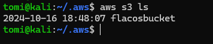
---

#### 3. **Python 3.x und pip installieren**

- **Installation auf Ubuntu/Debian:**
```bash
sudo apt update
```
```bash
sudo apt install python3 python3-pip -y
```
- **Verifizierung:**  
Überprüfe die installierte Version von Python und pip:
```bash
python3 --version
```
```bash
pip3 --version
```

---

#### 4. **Abhängigkeiten aus `requirements.txt` installieren**

- **Installiere die Abhängigkeiten:**  
Nutze pip, um die Pakete aus der `requirements.txt` Datei zu installieren:
```bash
pip3 install -r requirements.txt
```
- **Verifizierung der boto3-Installation:**  
Überprüfe, ob `boto3` korrekt installiert wurde:
```bash
pip3 show boto3
```

------------------------------------------------------------

**Alles bereit!**

Die notwendigen Tools und Pakete sind installiert. Nun müssen wir noch 3 kleine Schritte machen, bevor wir das Skript ausführen können.

------------------------------------------------------------

### Schritte zur Ausführung des Skripts

Es ist wichtig zu beachten, dass alle unsere Files sich im gleichen Verzeichnis befinden:

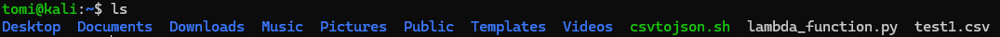

**Im ersten Schritt muss der Role ARN (Amazon Resource Name) geändert werden.**

Der Grund, warum jeder Nutzer oder jede Umgebung eine individuelle Role ARN benötigt, liegt darin, dass Rollen an bestimmte AWS-Konten, Berechtigungen und Sicherheitsrichtlinien gebunden sind.

Der Role ARN kann im IAM-Dashboard eingesehen werden.

Dafür geht man ins IAM-Dashboard rein.

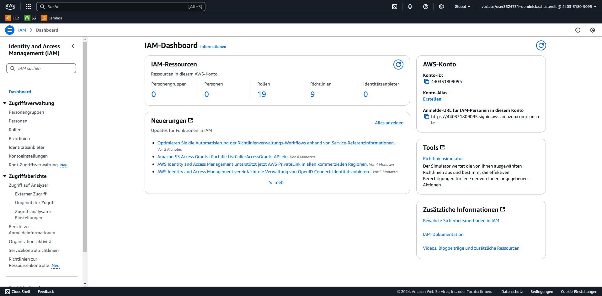

Beim Reiter Zugriffsverwaltung kann man dann auf "Rollen" klicken:

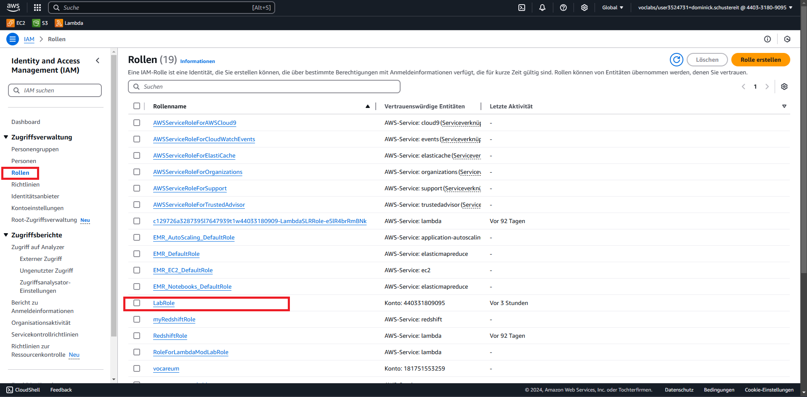

Nun werden sämtliche Rollen angezeigt.

Dann klickt man auf die "Lab Role"


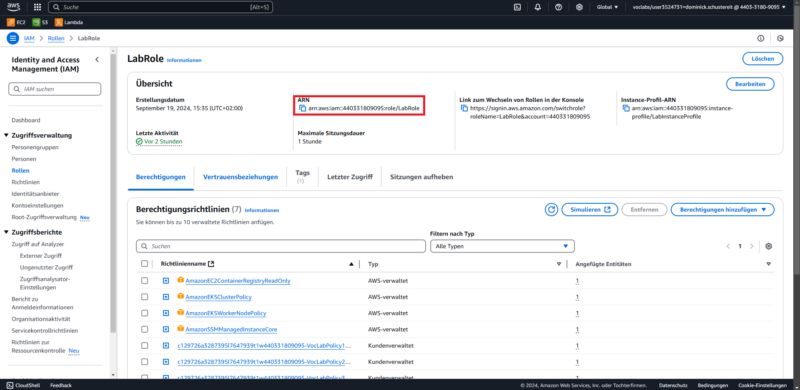


Nun sieht man den ARN

Diesen muss man rauskopieren und dann mit einem Texteditor wie Nano in das File csvtojson.sh einfügen:


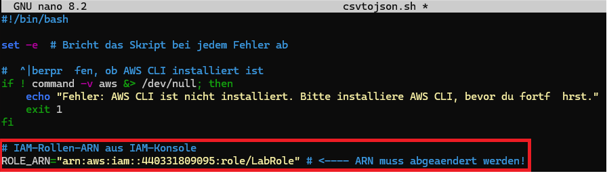


**Im zweiten Schritt müsen wir unsere Lambda Function "lambda_function.py" zippen.**

Dies machen wir mit folgendem Befehl:

```
zip lambda_function.zip lambda_function.py
```
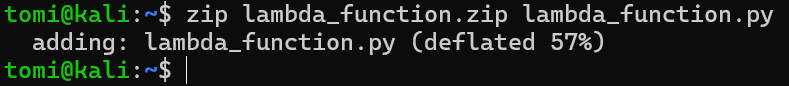

- **Wenn wir dies gemacht haben, müssen wir das File noch ausführbar machen**

Dies können wir mit chmod machen:

```bash
chmod +x csvtojson.sh
```
------------------------------------------------------------
### Ausführen des Skripts

Wir führen unser Skript nun mit:

```bash
./csvtojson.sh
```
aus. 

Wie wir sehen, wird am Anfang unsere ganze Infrastruktur eingerichtet.

Als erstes werden die 2 Buckets erstellt, wichtig zu beachten war hierbei, dass die Buckets immer einen **universell**

**einmaligen** Namen bekommen, dies konnten wir mit der "TIMESTAMP=$" Variable bewerkstelligen.

Im nächsten Schritt wird die Lambda Funktion in AWS erstellt und es werden die Lambda-Berechtigungen für den S3-Trigger hinzugefügt.

Danach wir der S3-Trigger konfiguriert.

Das Skript nimmt dann unser "test1.csv" und lädt es in den Input-Bucket hoch.

Im nächsten Schritt wird das CSV-File zu einem JSON-File konvertiert und in den Output-Bucket hochgeladen.

Danach downloadet es für uns die fertige JSON-Datei namens "test1.json" und das Skript zeigt uns schon die Datei mit korrekter Syntax an.


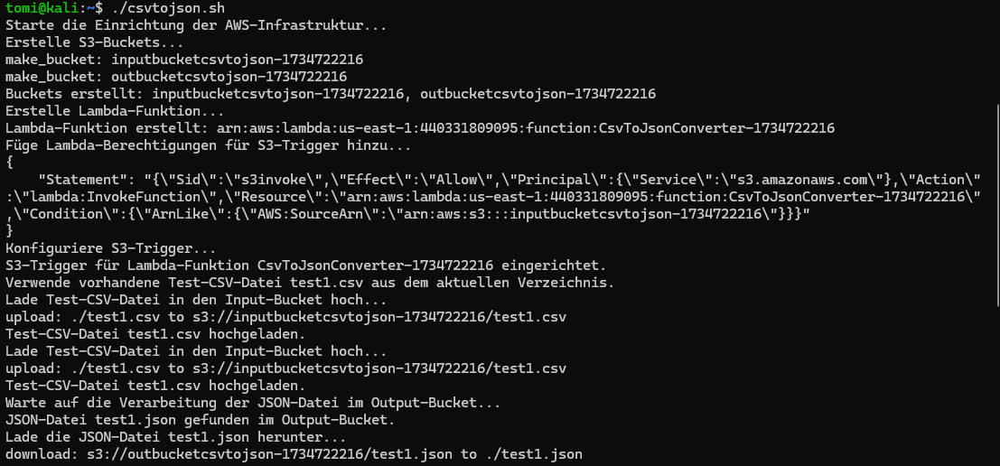

Nun können wir noch validieren, ob das Skript wirklich alles gemacht hat:

Als erstes listen wir unsere Buckets auf:

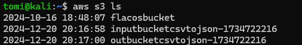

Wie wir sehen wurden unsere Buckets erfolgreich hinzugefügt.

Nun validieren wir noch unsere Funktion, hierbei können wir den Namen aus dem Skript entnehmen und die Region noch auf "us-east-1" eingrenzen.

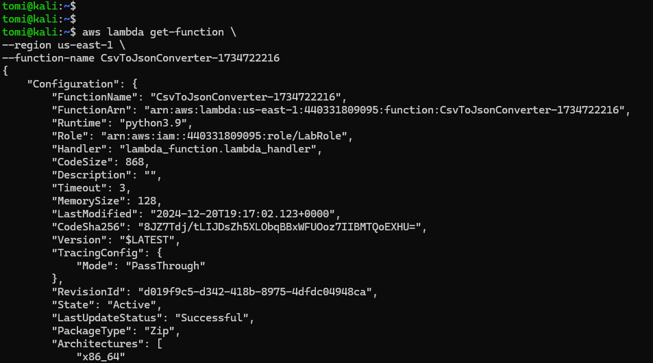

Die Durchführung des Skripts hat erfolgreich funktioniert, alles ist vorhanden und funktioniert so wie es sollte.

#### **Testing**

| **Testnummer** | **Testdatum**   | **Testperson**   | **Testbeschreibung**                       | **Erwartetes Ergebnis**                         | **Tatsächliches Ergebnis**                      | **Status**  | **Bemerkungen**                   |
|----------------|-----------------|------------------|-------------------------------------------|------------------------------------------------|------------------------------------------------|------------|------------------------------------|
| 1              | 2024-12-16      | Louis Gross      | Skript ausführen ohne konfigurierte ARN    | Skript wird nicht ausgeführt, Fehlerausgabe    | Fehlerausgabe: "ARN fehlt"                      | ✅ Bestanden | Fehler korrekt abgefangen         |
| 2              | 2024-12-15      | Louis Gross      | CSV-Datei hochladen in den Input-Bucket    | Datei wird erfolgreich hochgeladen             | Datei im Bucket sichtbar                       | ✅ Bestanden | Keine                             |
| 3              | 2024-12-19      | Louis Gross      | Lambda-Funktion triggert beim Upload       | Funktion wird ausgeführt, JSON wird erstellt   | JSON-Datei im Output-Bucket sichtbar           | ✅ Bestanden | Keine                             |
| 4              | 2024-12-18      | Louis Gross      | Upload einer fehlerhaften CSV-Datei        | Skript bricht ab, Fehlerausgabe                | Fehlerausgabe: "Ungültige CSV"                 | ✅ Bestanden | Keine                             |
| 5              | 2024-12-18      | Louis Gross      | Ausführen ohne Berechtigungen              | Skript meldet fehlende Berechtigungen          | Fehlerausgabe: "Zugriff verweigert"            | ✅ Bestanden | Zugriffsprüfung funktioniert      |
| 6              | 2024-12-20      | Louis Gross      | Mehrere Dateien gleichzeitig hochladen     | Alle Dateien werden verarbeitet                | Alle JSON-Dateien im Output-Bucket sichtbar    | ✅ Bestanden | Keine                             |
| 7              | 2024-12-17      | Louis Gross      | Überprüfung der JSON-Struktur              | Struktur entspricht der Vorgabe                | Alle JSON-Felder korrekt erstellt              | ✅ Bestanden | Keine                             |
| 8              | 2024-12-13      | Louis Gross      | Test mit leerer CSV-Datei                  | Keine Verarbeitung, Fehlerausgabe              | Fehlerausgabe: "Leere Datei"                   | ✅ Bestanden | Keine                             |
| 9              | 2024-12-15      | Louis Gross      | Test mit großer CSV-Datei (>10 MB)         | Verarbeitung dauert länger, bleibt stabil      | JSON korrekt erstellt                          | ✅ Bestanden | Keine                             |
| 10             | 2024-12-17      | Louis Gross      | End-to-End-Test                            | CSV wird zu JSON, ohne Fehler                  | Alle Schritte erfolgreich durchlaufen          | ✅ Bestanden | Keine                             |


Die durchgeführten Tests haben gezeigt, dass unser Skript zuverlässig funktioniert und die gewünschten Anforderungen erfüllt. Wir haben verschiedene Szenarien überprüft, darunter die Verarbeitung von CSV-Dateien, die korrekte Triggerung der Lambda-Funktion sowie den Umgang mit fehlerhaften oder leeren Dateien. Besonders erfreulich war, dass das Skript auch bei größeren Datenmengen stabil blieb und die JSON-Ausgabe korrekt erstellt wurde.

Insgesamt sind wir mit den Testergebnissen sehr zufrieden. Die Tests haben uns bestätigt, dass die entwickelte Lösung robust und vielseitig einsetzbar ist. Für zukünftige Projekte nehmen wir mit, dass eine strukturierte Testphase nicht nur die Qualität sichert, sondern auch das Vertrauen in das eigene Produkt stärkt.

#### **Ablaufprozess**


#### **Reflexion**
Am Ende jeder Arbeit ist eine sorgfältige Reflexion von großer Bedeutung. Sie ermöglicht es, Erfolge wie auch Schwierigkeiten zu erkennen, aus Erfahrungen zu lernen und so die nächste Aufgabe noch besser anzugehen. Eine ehrliche Analyse des eigenen Vorgehens schafft Klarheit, motiviert zur Weiterentwicklung und trägt langfristig zu einer höheren Qualität der Ergebnisse bei.

## **Reflexion Dominick**

Als wir das Projekt durchführten, stießen wir auf einige Schwierigkeiten. So war es beispielsweise unklar, ob das Skript ohne manuelles Konfigurieren der ARN lauffähig ist, da diese je nach Nutzer unterschiedlich ist. Außerdem haben wir zunächst alle Änderungen in ein Test-Repository gepusht und erst am Ende in das finale Abgabe-Repository übertragen. Dieser zusätzliche Schritt hat unnötig Zeit gekostet, die wir uns durch eine bessere Planung im Vorfeld hätten sparen können. Bei einem logischen Problem im Ablauf des Skripts konnte uns Herr Dall Acqua unterstützen, sodass wir den Fehler letztendlich beheben konnten.

Rückblickend haben wir viel dazugelernt, insbesondere im Umgang mit AWS, Linux und der gesamten AWS-Infrastruktur. Wir haben erkannt, dass sich Python sehr gut für Skripte und automatisierte Abläufe eignet, und trotzdem sind wir mit unserem Bash-Skript zufrieden, da es am Ende seine Aufgabe erfüllt. Für zukünftige Projekte nehmen wir uns vor, mehr Zeit für die Planung aufzuwenden und die Aufgaben effizienter zu gestalten. Zudem dachten wir, dass die Dokumentation weniger zeitaufwendig sein würde, doch insbesondere das Erstellen der Screenshots hat deutlich mehr Zeit in Anspruch genommen als erwartet. Insgesamt sind wir mit dem Ergebnis zufrieden und spüren deutlich, wie wir unser Fachwissen erweitern konnten.


## **Reflexion Alex**

Als ich den Code geschrieben habe, stellte sich vor allem die Handhabung der dynamischen Output-Bucket-Namen als äusserst knifflig heraus. Da das Skript aufgeteilt ist – in eine lambda_function.py und ein csvtojson.sh – mussten wir sicherstellen, dass beide Teile genau wissen, welcher Input-Bucket zu welchem Output-Bucket gehört. Dieser Abgleich war nicht trivial, weil die Informationen aus einem Skript ins andere übertragen und korrekt verarbeitet werden mussten. Die Koordination der beiden Skripte hat deutlich mehr Zeit in Anspruch genommen, als ich anfangs erwartet hatte.
Auch der Umgang mit den ARN-Rollen war eine Herausforderung, da diese bei jedem Nutzer unterschiedlich sind und entsprechend dynamisch verarbeitet werden müssen. Hier half es mir, "out-of-the-box" zu denken und ein paar unkonventionelle Lösungsansätze auszuprobieren, um schliesslich eine robuste Lösung zu finden. Insgesamt habe ich durch diese Schwierigkeiten eine Menge über die Feinheiten von AWS und die Bedeutung sauberer Schnittstellen zwischen verschiedenen Code-Bestandteilen gelernt. Rückblickend hätte ich an manchen Stellen mehr Zeit für die Planung investieren sollen, um solche Komplikationen zu reduzieren. Nichtsdestotrotz bin ich am Ende zufrieden damit, was wir erreicht haben, und weiss, dass ich diese Erfahrungen in zukünftige Projekte einbringen kann.

## **Reflexion Louis**

Während des Projekts sind wir auf verschiedene Herausforderungen gestoßen, die uns wichtige Erkenntnisse gebracht haben. Der Umgang mit mehreren Repositories führte dazu, dass anfängliche Commits verloren gingen, was die Arbeit weniger transparent machte. Dies zeigte uns, wie wichtig eine einheitliche Struktur und klare Planung in der Versionsverwaltung ist.
Ein weiteres Problem war die manuelle Konfiguration der ARN, die je nach Nutzer individuell ist. Hier wurde uns bewusst, dass automatisierte Lösungen Zeit und Aufwand sparen könnten.
Trotz dieser Hürden konnten wir viel lernen, insbesondere über AWS, Linux und Automatisierung mit Skripten. Unser Bash-Skript erfüllte die Anforderungen zuverlässig, und wir konnten unser technisches Wissen deutlich erweitern.
Für zukünftige Projekte nehmen wir uns vor, die Planungsphase sorgfältiger zu gestalten und mehr Zeit für Dokumentation und Tests einzuplanen. Insgesamt sind wir mit dem Ergebnis zufrieden und fühlen uns gut vorbereitet für kommende Herausforderungen.


## Quellen

1. **AWS CLI Dokumentation**  
   *Offizielle Dokumentation zur Installation, Konfiguration und Nutzung der AWS CLI:*  
   [https://docs.aws.amazon.com/cli/latest/userguide/cli-chap-welcome.html](https://docs.aws.amazon.com/cli/latest/userguide/cli-chap-welcome.html)

2. **Python-Entwicklung mit boto3**  
   *Ein Leitfaden zur Arbeit mit der AWS Python SDK "boto3" für Automatisierungen:*  
   [https://boto3.amazonaws.com/v1/documentation/api/latest/index.html](https://boto3.amazonaws.com/v1/documentation/api/latest/index.html)

3. **Best Practices für IAM-Rollen und Berechtigungen**  
   *Wie man IAM-Rollen korrekt erstellt und verwendet, um Sicherheit und Effizienz zu gewährleisten:*  
   [https://aws.amazon.com/iam/](https://aws.amazon.com/iam/)

4. **Bash-Skripting Grundlagen**  
   *Einführung in das Erstellen von automatisierten Skripten unter Linux:*  
   [https://linuxconfig.org/bash-scripting-tutorial-for-beginners](https://linuxconfig.org/bash-scripting-tutorial-for-beginners)

5. **JSON-Format-Spezifikation**  
   *Offizielle Beschreibung des JSON-Formats, das für den Datenaustausch genutzt wird:*  
   [https://www.json.org/json-en.html](https://www.json.org/json-en.html)

6. **Dynamisches S3-Bucket-Management**  
   *AWS-Ressourcen zur dynamischen Benennung und Verwaltung von S3-Buckets:*  
   [https://docs.aws.amazon.com/AmazonS3/latest/userguide/UsingBucket.html](https://docs.aws.amazon.com/AmazonS3/latest/userguide/UsingBucket.html)

7. **Effektives Debugging in AWS Lambda**  
   *Hilfreiche Ansätze zur Fehlerbehebung in AWS Lambda-Funktionen:*  
   [https://aws.amazon.com/lambda/](https://aws.amazon.com/lambda/)

8. **Planung und Durchführung von Softwareprojekten**  
   *Best Practices für die effiziente Planung und Ausführung von Projekten:*  
   [https://pmtraining.com/blog/software-project-planning](https://pmtraining.com/blog/software-project-planning)

9. **Linux-Umgebungen und Pip-Installation**  
   *Schritte zur Installation und Verwaltung von Python-Paketen unter Linux:*  
   [https://pip.pypa.io/en/stable/installation/](https://pip.pypa.io/en/stable/installation/)


